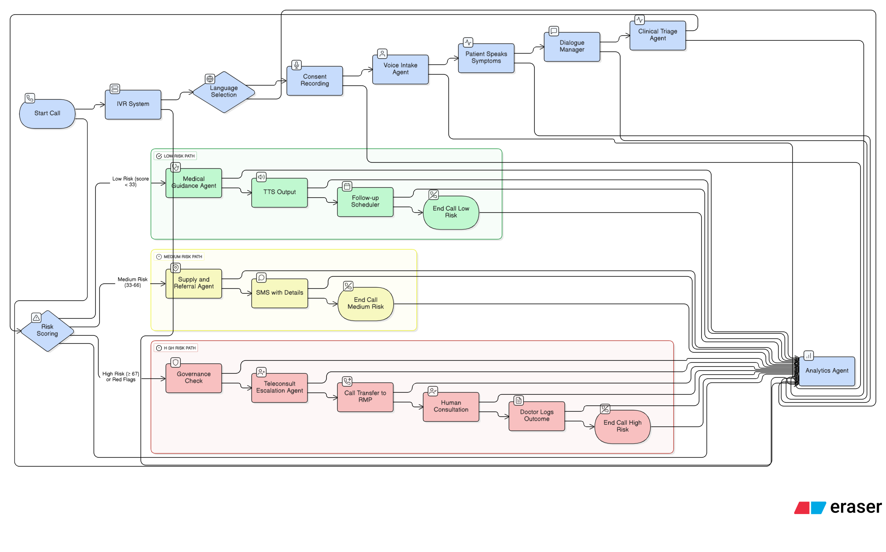

# SwasthyaAI: Smart Voice + Agentic Health Assistant

## 📋 Table of Contents

- [Problem Statement](#problem-statement)
- [Proposed Solution](#proposed-solution)
- [Technical Stack](#technical-stack)
- [System Architecture](#system-architecture)
- [Multi-Agent System Design](#multi-agent-system-design)
- [Implementation Workflow](#implementation-workflow)
- [Security & Compliance](#security--compliance)
- [Impact & Outcomes](#impact--outcomes)
- [Roadmap & Future Scope](#roadmap--future-scope)

---

## 🚨 Problem Statement

### The Healthcare Crisis in Rural India

Rural India faces a severe, multi-dimensional healthcare accessibility crisis affecting over **65% of the population** (**~900 million people**). The current healthcare infrastructure is characterized by systemic gaps that result in preventable deaths, delayed diagnoses, and economic devastation for families.

### Critical Challenges

1. **Only 1 doctor per 10,000 people** in rural areas (WHO recommends 1:1000)
2. Primary Health Centers (PHCs) operate at **30-40% staff capacity**
3. Average distance to nearest PHC: **15-20 km**
4. Poor road connectivity; journey time often **2-4 hours**
5. Only **31% smartphone penetration** in rural areas
6. Internet connectivity remains sparse and unreliable
7. **780+ languages and dialects** spoken across India

### Gap in Existing Solutions

Current digital health interventions fail because they:

1. Assume **continuous internet** and **smartphone access**
2. Require **app downloads** and **registration friction**
3. Operate only in **English or Hindi**

**What's Missing:** A voice-first, toll-free, AI-powered clinical assistant that meets people where they are accessible via any phone, in any language, providing immediate and safe medical guidance.

---

## 💡 Proposed Solution

### SwasthyaAI: AI Voice Medical Assistant

A **single toll-free number** accessible **across India** that connects callers to an intelligent, multilingual **AI health assistant** capable of providing **clinical triage**, **health guidance**, and seamless escalation to human doctors.

### Core Value Proposition

**ANY PHONE + ANY LANGUAGE + ZERO COST = IMMEDIATE HEALTHCARE ACCESS**

### Solution Components

#### 🎙️ Voice-First Interface

- **Toll-free access** via basic phones (**no smartphone required**)
- **12+ language support** with automatic language detection

#### 🤖 AI-Powered Clinical Triage

- **Risk stratification** (Low/Medium/High urgency)
- **RAG-based reasoning** leveraging clinical protocols and guidelines
- **Contextual follow-up questions** to gather complete clinical picture

#### 🔄 Multi-Agent Orchestration

- **Specialized AI agents** for different healthcare tasks
- **LangGraph coordination** for seamless agent collaboration
- **Fail-safe mechanisms** ensuring clinical safety

#### 📊 Actionable Guidance

- **Self-care recommendations** for low-risk conditions
- **PHC referrals** with nearest facility information
- **Immediate doctor connection** for emergencies
- **Medicine availability** and local pharmacy information

#### 📈 Follow-Up & Analytics

- **Automated follow-up calls** for adherence monitoring
- **Anonymized data collection** for policy insights

---

## 🛠️ Technical Stack

### Complete Technology Matrix

| Layer | Technology | Purpose | Justification |
|-------|-----------|---------|---------------|
| **Telephony** | Twillio / Knowlarity | IVR & Call Routing | India-focused, TRAI compliant, toll-free support |
| **ASR (STT)** | Deepgram + Sarvam.ai | Speech Recognition | Deepgram for accuracy, Sarvam for Indic languages |
| | Whisper (fine-tuned) | Fallback ASR | Open-source, customizable for regional accents |
| **Language Detection** | FastText | Real-time language ID | Fast, supports 170+ languages |
| **LLM** | Groq LLM | Fast Clinical Triage | Ultra-low latency (<100ms), optimized inference |
| **LLM** | OpenAI GPT-4o | Natural Responses | Superior language quality, empathetic tone |
| **Orchestration** | LangGraph | Multi-Agent Workflow | Graph-based agent coordination, state management |
| **RAG Framework** | LangChain | Retrieval Pipeline | Standardized RAG implementation |
| **Vector DB** | Milvus / Pinecone | Medical Knowledge Store | Fast similarity search, scalable |
| **Embeddings** | OpenAI text-embedding-3-large | Semantic Search | High-quality medical text embeddings |
| **TTS** | Sarvam.ai + ElevenLabs | Speech Synthesis | Natural-sounding Indic voices |
| **Backend** | FastAPI (Python) | REST API | Async support, high performance |
| **Database** | PostgreSQL | Structured Data | Call logs, patient records, audit trails |
| **Cache** | Redis | Session Management | Fast key-value store, sub-millisecond latency |
| **Task Queue** | Celery | Async Processing | Background jobs, follow-up scheduling |
| **Monitoring** | Prometheus + Grafana | System Metrics | Real-time performance monitoring |
| **Logging** | ELK Stack | Centralized Logging | Elasticsearch, Logstash, Kibana |
| **Deployment** | Docker + Kubernetes | Container Orchestration | Scalable, auto-healing infrastructure |

### AI Processing Pipeline

---

## 🏗️ System Architecture

### High-Level Architecture Overview

### Component Architecture Details

---

## 🤝 Multi-Agent System Design

### Agent Architecture Philosophy

SwasthyaAI employs a **specialized multi-agent architecture** where each agent is an expert in a specific domain, coordinated by LangGraph for optimal collaboration and fail-safe operation.

### Agent Specifications

#### 🎤 Voice Intake Agent
- **Role:** First point of contact; handles audio input and preprocessing
- **Technologies:** Silero VAD, FastText, Exotel SDK
- **Outputs:** Clean audio stream, language code, consent flag

#### 💬 Dialogue Manager Agent
- **Role:** Orchestrates conversation flow and ensures information completeness
- **Technologies:** LangGraph state management, Redis session store

#### 🏥 Clinical Triage Agent
- **Role:** Core medical intelligence; analyzes symptoms and assigns urgency
- **RAG Knowledge Base:**
  - WHO clinical protocols
  - Indian Council of Medical Research (ICMR) guidelines
  - National Health Mission (NHM) standard treatment protocols
  - Common rural health conditions database

#### 📋 Medical Guidance Agent
- **Role:** Translates clinical findings into patient-friendly advice
- **Technologies:** OpenAI GPT-4o, Cultural context prompts
- **Output Examples:**
  - **LOW RISK (Common Cold):**
    - "आपको सामान्य सर्दी-जुकाम हो सकता है। गर्म पानी पिएं, आराम करें। 2-3 दिन में ठीक हो जाएगा। अगर बुखार बढ़े तो PHC जाएं।"
  - **MEDIUM RISK (Persistent Cough):**
    - "आपकी खांसी 2 हफ्ते से है, यह TB या संक्रमण हो सकता है। कृपया जल्द से जल्द PHC जाकर जांच कराएं।"
  - **HIGH RISK (Chest Pain):**
    - "यह गंभीर स्थिति है। मैं आपको तुरंत डॉक्टर से जोड़ रहा हूं। कृपया लाइन पर रुकें।" [Immediate escalation]

#### 📞 Teleconsult Escalation Agent
- **Role:** Seamlessly connects patients to human doctors when needed
- **Technologies:** Plivo/Twilio for call routing, PostgreSQL doctor registry

#### 🗺️ Supply & Referral Agent
- **Role:** Provides local healthcare resource information
- **Technologies:** GIS/Geolocation, Vector DB for facility data
- **Example Output:** "आपके नजदीकी PHC है: खेड़ा PHC (5 km), फोन: 02762-XXXXX। एम्बुलेंस के लिए 108 डायल करें।"

#### ⚖️ Governance Agent
- **Role:** Ensures clinical safety, ethical compliance, and regulatory adherence
- **Technologies:** LangGraph policy nodes, Pydantic validation, audit logger

#### 📊 Analytics Agent
- **Role:** Monitors system performance and generates health insights
- **Technologies:** Prometheus metrics, PostgreSQL analytics, Pandas/NumPy

---

## 🔄 Implementation Workflow

### Complete Call Flow Diagram

### State Machine Design

---

## 🔒 Security & Compliance

### Regulatory Compliance Framework

| Requirement | SwasthyaAI Implementation |
|-------------|---------------------------|
| Registered Medical Practitioner (RMP) oversight | All high-risk cases escalated to verified RMPs |
| Patient consent | Audio consent captured in native language before proceeding |
| Patient identification | Phone number + OTP verification for follow-ups |
| Prescription limitations | AI never prescribes; only RMPs can via teleconsult |
| Medical records | Anonymized call logs stored for 7 years (per MCI guidelines) |
| Emergency protocols | Red-flag symptoms trigger immediate doctor connection |
| Data privacy | Compliant with IT Act 2000, Digital Personal Data Protection Act 2023 |

### ABDM (Ayushman Bharat Digital Mission) Integration

1. **Health ID integration:** Optional ABHA (Ayushman Bharat Health Account) linking
2. **Consent manager:** Patients control who accesses their health records
3. **Interoperability:** FHIR-compliant data exchange with hospitals/PHCs
4. **Unified Health Interface (UHI):** Future integration for seamless care coordination

### Ethical AI Principles

1. **Transparency:** Patients informed they're speaking with AI, not human doctor
2. **Fairness:** Bias testing across demographics (gender, age, region, caste)
3. **Accountability:** All decisions auditable; clear escalation chains
4. **Safety:** Conservative approach; when in doubt, escalate to human
5. **Privacy:** Data minimization; collect only what's clinically necessary

---

## 📈 Impact & Outcomes

### Target Beneficiaries

| Stakeholder | Benefit |
|-------------|---------|
| **Rural Patients** | Instant access to health guidance; reduced travel costs; native language support |
| **ASHA Workers** | AI-powered decision support; reduced workload; digital training tools |
| **PHC Doctors** | Pre-triaged patients; complete case history; focus on complex cases |
| **District Health Officers** | Real-time disease surveillance; resource allocation insights; performance metrics |
| **State Health Departments** | Evidence-based policymaking; budget optimization; outcome tracking |
| **Researchers** | Anonymized health data for epidemiological studies |

---

## 🗺️ Roadmap & Future Scope

### Phase-Wise Rollout Plan

### Future Feature Enhancements

1. **Video Consultation:** Enable video calls for visual symptom assessment
2. **Medicine Delivery Integration:** Partner with pharmacies for home delivery
3. **WhatsApp Bot:** Alternative interface for smartphone users
4. **Wearable Integration:** Sync with BP monitors, glucometers, pulse oximeters
5. **Offline Mode:** Edge AI deployment for zero-connectivity areas
6. **Community Health Groups:** IVR-based health camps and awareness drives
7. **AI-Powered Diagnostics:** Image analysis for skin conditions, X-rays
8. **Predictive Health:** Identify at-risk individuals before symptoms appear
9. **Genomic Integration:** Pharmacogenomics for personalized medicine
10. **Global Health Intelligence:** Cross-border disease surveillance
11. **Research Platform:** Anonymized data for clinical trials and studies

---

## 🤝 Contributing

We welcome contributions! Please see our contributing guidelines for more details.

## 📄 License

This project is licensed under the MIT License - see the LICENSE file for details.

## 📧 Contact

For questions or collaboration opportunities, please reach out to [your-email@example.com]

---

**Made with ❤️ for Rural India**
